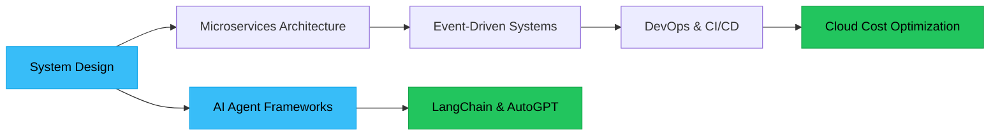

<div align="center">

<!-- Animated Header with Gradient -->


<!-- Animated Typing -->


<br/>

<!-- Social Badges with Hover Effect -->
[](https://linkedin.com/in/itinerant018)
[](https://stackoverflow.com/users/16643552/aniket-karmakar)
[](mailto:itinerant018@gmail.com)
[](https://github.com/Itinerant18)

<br/>

<!-- Profile Views Counter -->


</div>

---

## 🎯 About Me

```typescript
const aniket = {
    role: "Full-Stack Engineer",
    mindset: "Founder-Oriented Product Builder",
    focus: ["AI/ML Systems", "Cloud Architecture", "Scalable Products"],
    philosophy: "Execution > Ideas 💡",
    approach: "MVP → Scale → Optimize 🚀"
};
```

I'm a **startup-minded developer** who transforms ideas into **production-ready, intelligent systems**. I don't just write code — I architect solutions that solve real business problems using modern tech stacks.

**Currently Building:** AI-powered products | Cloud-native architectures | IoT integrations

---

## 💼 Professional Experience

### 🏢 **Software Engineer** @ Security Engineers Pvt. Ltd.

```yaml
Responsibilities:
  - Full-stack platform development for production environments
  - AI-powered dashboards and intelligent automation systems
  - IoT device integration with live data pipelines
  - Secure backend APIs with advanced authentication
  - Cross-functional collaboration with product and hardware teams
```

**Impact:** Delivered scalable solutions used in real-world security and monitoring systems

---

## 🛠️ Technology Arsenal

<div align="center">

### **Frontend Ecosystem**


### **Backend & APIs**


### **AI & Machine Learning**


### **Cloud & DevOps**


### **Databases**


</div>

---

## 🤖 AI/ML Specializations

<table align="center">
<tr>
<td width="50%">

**🎯 Core Capabilities**
- AI Agents & LLM Workflows
- Predictive Analytics Systems
- NLP Chatbots & Assistants
- Production ML Pipelines
- Hybrid AI Architectures

</td>
<td width="50%">

**🔧 Implementation Focus**
- Model Integration (APIs)
- Real-time Inference Systems
- Data Processing Pipelines
- AI-Powered Automation
- Intelligent Decision Engines

</td>
</tr>
</table>

---

## 🎓 Learning Journey

### 📚 **Previous Learning Path**

<table>
<tr>
<td width="33%" align="center">

**Phase 1: Frontend Mastery** 🎨
```
HTML/CSS → JavaScript
↓
React.js → Next.js
↓
UI/UX Design
```
</td>
<td width="33%" align="center">

**Phase 2: Backend Development** ⚙️
```
Node.js → Python
↓
Django → FastAPI
↓
RESTful APIs → Auth
```
</td>
<td width="33%" align="center">

**Phase 3: Core Fundamentals** 📊
```
Data Structures
↓
Algorithms
↓
System Design Basics
```
</td>
</tr>
</table>

<div align="center">

**Languages Mastered:** `Java` → `Python` → `JavaScript/TypeScript` → `SQL`

</div>

---

### 🌱 **Current Learning Path**



**Focus Areas:** Advanced system architecture, scalable microservices, intelligent AI agents, production DevOps

---

## 🤝 Open For Collaboration

<div align="center">

| 🚀 **Startup Projects** | 🤖 **AI/ML Systems** | 💼 **Product Roles** | 🔬 **Open Source** |
|:---:|:---:|:---:|:---:|
| Early-stage products | Intelligent backends | Full-stack teams | Research projects |

</div>

**Let's build something amazing together!** I'm passionate about working on projects that have real impact.

---

## 💡 Developer Wisdom

<div align="center">
  
</div>

---

## 📊 Contribution Graph

<p align="center">
  <a href="https://github.com/Itinerant18">
    
  </a>
</p>

---

## 💙 Support My Work

<div align="center">

If you find my work valuable, consider buying me a coffee! ☕

[](https://buymeacoffee.com/userdefiney)

</div>

---

<div align="center">

### 💬 Let's Connect!

**"The best way to predict the future is to build it."**


</div>
